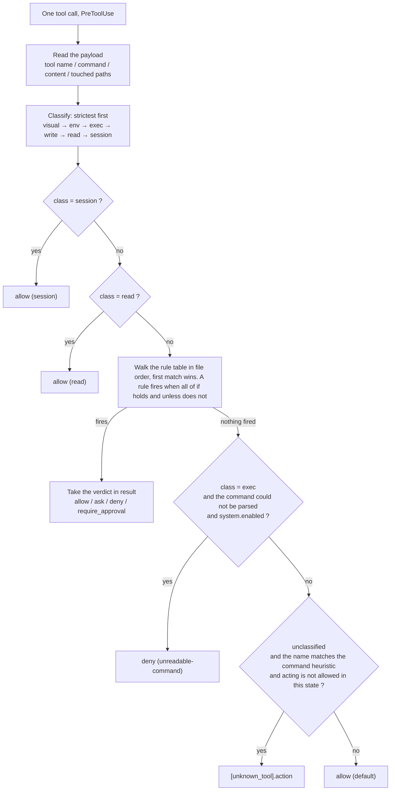

# OCF Policy Configuration Guide

English | [中文](POLICY-GUIDE_CH.md)

---

## 1. Rule format

A rule is one `[[rule]]` block in `policy.toml`.

```toml
[[rule]]
id      = "no-prod-config"                    # the rule's label
enabled = "switch"                            # the enable control
kind    = "hard"                              # hard: the hook; soft: the standing guidance text
result  = "deny"                              # the verdict when it fires
message = "Production config belongs to the human; hand it over when done."   # the readable explanation
unless  = { computed = "control_plane" }      # the scenario it is bypassed in

[rule.if]
class        = "write"                        # the tool class it matches
path_matches = '^config/prod/'                # a condition this rule owns: a path regex
```

### Fields

| Field       | Required  | Meaning                                                                                    |
| ----------- | --------- | ------------------------------------------------------------------------------------------ |
| `id`        | yes       | The rule's identifier                                                                      |
| `enabled`   | no        | Three spellings, see below                                                                 |
| `kind`      | no        | `hard` (the default) or `soft`                                                             |
| `label`     | soft only | The short name used when it is listed in the standing contract and in the reference region |
| `[rule.if]` | **yes**   | The condition table that fires it                                                          |
| `unless`    | no        | The exception. A condition table for a hard rule; for a soft rule a described scenario     |
| `result`    | hard only | Required for a hard rule: the verdict - `allow` / `ask` / `deny` / `require_approval`      |
| `else`      | no        | Soft only, optional: the text injected while it is off                                     |
| `message`   | yes       | Handed back by the hook, or injected into the guidance text, for the agent                 |

### The values `enabled` accepts

| Spelling   | Meaning                   |
| ---------- | ------------------------- |
| `true`     | Always on                 |
| `false`    | Always off                |
| `"switch"` | Follows the master switch |

### Conditions (the keys of `[rule.if]`)

Each key is one condition; its value is what it compares against.

| Condition                              | What it compares                                                                                                                                                                                                                                                                          |
| -------------------------------------- | ----------------------------------------------------------------------------------------------------------------------------------------------------------------------------------------------------------------------------------------------------------------------------------------- |
| `class`                                | The tool class: `visual` / `env` / `exec` / `write` / `read` / `session` / `unknown`, or `any`                                                                                                                                                                                            |
| `occasion`                             | The occasion a rule is for. For a **hard** rule the state: `ready` / `asking` / `planning` / `executing` / `reporting` / `blocked`. For a **soft** rule the moment: `session-start` / `ask` / `plan` / `act` / `answer`. One key, two sets of values - the `kind` decides which are legal |
| `tool`                                 | The tool name as the editor reports it                                                                                                                                                                                                                                                    |
| `command_matches`                      | Regex against the command string                                                                                                                                                                                                                                                          |
| `command_length_over`                  | Ceiling on the command's length                                                                                                                                                                                                                                                           |
| `command_statements_over`              | Ceiling on the number of statements                                                                                                                                                                                                                                                       |
| `command_repeats_at_least`             | How many times this exact command has already run                                                                                                                                                                                                                                         |
| `content_matches`                      | What would be written, plus the raw tool input                                                                                                                                                                                                                                            |
| `environment_declared`                 | Whether the human has declared the existing environment                                                                                                                                                                                                                                   |
| `approval`                             | Approval is still required                                                                                                                                                                                                                                                                |
| `computed`                             | A flag computed from the command, see below                                                                                                                                                                                                                                               |
| `fact` with `is` / `is_not` / `is_set` | A fact recorded by the human or the hook: equals / does not equal / non-empty                                                                                                                                                                                                             |
| `write_target_unread`                  | The call writes, but **where it writes could not be read**                                                                                                                                                                                                                                |
| `path_matches`                         | A path regex, matched against the paths this call touches                                                                                                                                                                                                                                 |
| `touches_protected`                    | Whether each path this call would change is on the protected list                                                                                                                                                                                                                         |

### Flags (`computed`)

| Flag              | True when                                                                                                                                      |
| ----------------- | ---------------------------------------------------------------------------------------------------------------------------------------------- |
| `control_plane`   | **Every** statement invokes the entry script by its full relative path. Reading the state is not acting, so it must not be held up by approval |
| `invokes_entry`   | At least one statement invokes the entry script                                                                                                |
| `human_only_call` | The entry script is invoked with a **human-only subcommand** as its argument                                                                   |

### The four values of `result`

| Value              | Effect                     |
| ------------------ | -------------------------- |
| `allow`            | Let it through             |
| `ask`              | Ask                        |
| `deny`             | Refuse, and say why        |
| `require_approval` | Refuse, and request review |

---

## 2. How a rule is hit



---

## 3. How to configure

| What you want                          | Where to change it                | `reload`? | Window reload? |
| -------------------------------------- | --------------------------------- | --------- | -------------- |
| Add or change a gate rule              | `[[rule]]` in `policy.toml`       | **yes**   | no             |
| Change a threshold                     | the number inside that rule       | no        | no             |
| Stop a tool being blocked              | the relevant list under `[tools]` | no        | no             |
| Reword a soft rule                     | that rule's `message` text        | **yes**   | no             |
| Turn a rule off                        | its own `enabled` line            | no        | no             |
| Adjust overall strictness              | `[system] enabled`                | no        | no             |
| Change which hook events are installed | the `[hooks]` switches            | **yes**   | **yes**        |
| Add a self-check probe                 | `[selftest.canary]`               | no        | no             |

> [!INFO]
> A hard rule change takes effect immediately, but the documents do not follow.
> Use `reload` to rebuild the hard-rule documentation and the soft-rule injected text.
> Only `[hooks]` needs a window reload.

### Recipe 1: add a prohibition

```toml
[[rule]]
id      = "no-prod-config"
enabled = "switch"
result  = "deny"
message = "Production config belongs to the human; hand it over when done."

[rule.if]
class        = "write"
path_matches = '^config/prod/'
```

To beat an approval rule, put it **before** any `approval-required-*`.

### Recipe 2: add a tool

Add it to the matching list under `[tools]`.

- A tool listed in two classes is judged by the **stricter** one (`visual` is first).
- An unregistered tool that carries a command is judged as a command class; one that only carries a path falls to the command-class name heuristic.
- If its payload field is not the default `command` / `code`, add a field path under `[tools.field]`.

### Recipe 3: change a threshold

A threshold is **a number written inside the rule that uses it**, in that rule's `[rule.if]`. No `reload` needed.

### Recipe 4: turn a rule off

Set that rule's `enabled` to `false`.

### Recipe 5: add a soft rule

```toml
[[rule]]
id      = "my-discipline"
kind    = "soft"
label   = "short name"
enabled = "switch"
message = """
The sentence injected while it is ON."""
else    = """
The sentence injected while it is OFF. Optional."""

[rule.if]
occasion = "ask"
```

### Recipe 6: add a self-check probe

Add one under `[selftest.canary]`. A canary must go through the **real hook entry point**, or it does not prove the gate is alive. The whole set must contain **at least one that must deny and one that must allow**.

## 4. Related files and entries

- **Field and predicate vocabulary**: `.github/ocf/policy.toml`
- **Gates, tool classes and the rule list**: `.github/work-control-flow.md`
- **The standing guidance injected on every turn**: `.github/copilot-instructions.md`
- **The structural check list**: `.github/ocf/tests/run.py`
- **Project overview and the usage walkthrough**: [`README.md`](README.md)
