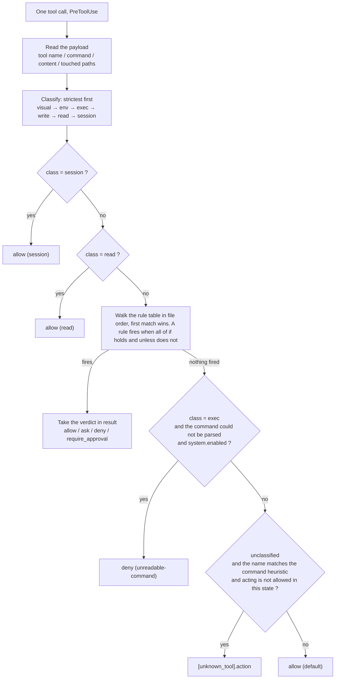

# OCF Policy Configuration Guide

English | [中文](POLICY-GUIDE_CH.md)

---

## 1. Rule format

A rule is one `[[rule]]` block in `policy.toml`. It answers exactly one question: **under which conditions should this tool call get which verdict.**

```toml
[[rule]]
id      = "no-prod-config"                    # every verdict carries this name, so a decision stays traceable
enabled = "switch"                            # follows the maintenance window (the default)
kind    = "hard"                              # hard: the hook gives a verdict; soft: written into the standing contract
result  = "deny"                              # the verdict to give when it fires
message = "Production config belongs to the human; hand it over when done."   # what the agent reads: say what to fix
unless  = { computed = "control_plane" }      # optional; the shape to use when an exemption is genuinely needed

[rule.if]
class        = "write"                        # which class of tool this call belongs to
path_matches = '^config/prod/'                # a condition this rule owns: a path regex, judged per path
```

### Fields

| Field       | Required  | Meaning                                                                                                                                                                                    |
| ----------- | --------- | ------------------------------------------------------------------------------------------------------------------------------------------------------------------------------------------ |
| `id`        | yes       | Every verdict carries it. The tests assert these names, so **renaming one fails a test instead of drifting**                                                                               |
| `enabled`   | no        | Three spellings, see below                                                                                                                                                                 |
| `kind`      | no        | `hard` (default, the hook gives a verdict) or `soft` (`reload` writes it into the standing contract)                                                                                       |
| `label`     | soft only | The short name a soft rule is listed under, in the generated contract and in the reference region                                                                                          |
| `[rule.if]` | **yes**   | Every condition that must hold. Omitting this block **makes the engine raise** - reading it as "no conditions, so always true" would turn a malformed rule into one that denies every call |
| `unless`    | no        | The exception. A condition table for a hard rule; a sentence the model applies for a soft rule                                                                                             |
| `result`    | hard only | One of the four verdicts: `allow` / `ask` / `deny` / `require_approval`. A soft rule gives no verdict, so it does not use this key                                                         |
| `else`      | no        | Soft only: the sentence injected while this rule is **off**. Absent means it says nothing when off                                                                                         |
| `message`   | yes       | The sentence the agent reads: handed back inside a hard rule's verdict, or injected into the standing contract while a soft rule is on                                                     |

### The values `enabled` accepts

| Spelling   | Meaning                   |
| ---------- | ------------------------- |
| `true`     | Always on                 |
| `false`    | Always off                |
| `"switch"` | Follows the master switch |

### Conditions (the keys of `[rule.if]`)

Each key is one condition; its value is what it compares against.

| Condition                              | What it compares                                                                                              |
| -------------------------------------- | ------------------------------------------------------------------------------------------------------------- |
| `class`                                | The tool class: `visual` / `env` / `exec` / `write` / `read` / `session` / `unknown`, or `any`                |
| `state`                                | The current state: `ready` / `asking` / `planning` / `executing` / `reporting` / `blocked`                    |
| `tool`                                 | The tool name as the editor reports it                                                                        |
| `command_matches`                      | Regex against the command string                                                                              |
| `command_length_over`                  | Ceiling on the command's length                                                                               |
| `command_statements_over`              | Ceiling on the number of statements (**quotes are blanked first**, so a `;` inside quotes is not a statement) |
| `command_repeats_at_least`             | How many times this exact command has already run                                                             |
| `content_matches`                      | What would be written, plus the raw tool input                                                                |
| `environment_declared`                 | Whether the human has declared the existing environment                                                       |
| `approval`                             | `true` when approval still applies, i.e. the state is not an acting state                                     |
| `computed`                             | A flag computed from the command, see below                                                                   |
| `fact` with `is` / `is_not` / `is_set` | A fact recorded by the human or the hook: equals / does not equal / non-empty                                 |
| `write_target_unread`                  | The call writes, but **where it writes could not be read**                                                    |
| `path_matches`                         | The paths this call touches, **judged per path, never as a batch**                                            |
| `touches_protected`                    | Whether each path this call would change is on the protected list, **judged per path**                        |

### Flags (`computed`)

| Flag              | True when                                                                                                                                      |
| ----------------- | ---------------------------------------------------------------------------------------------------------------------------------------------- |
| `control_plane`   | **Every** statement invokes the entry script by its full relative path. Reading the state is not acting, so it must not be held up by approval |
| `invokes_entry`   | At least one statement invokes the entry script                                                                                                |
| `human_only_call` | The entry script is invoked with a **human-only subcommand** as its argument                                                                   |

### The four values of `result`

| Value              | Effect                                                                                                             |
| ------------------ | ------------------------------------------------------------------------------------------------------------------ |
| `allow`            | Let it through                                                                                                     |
| `ask`              | The editor asks the human once. **A pre-approval may swallow it**, so do not put anything that must hold behind it |
| `deny`             | Refuse and say why. **Handled before any approval logic**, so nothing auto-approves past it                        |
| `require_approval` | Refuse, and tell the model to have the human run `approve` in their own terminal                                   |

---

## 2. How a rule is hit



---

## 3. How to configure

Suppose you are the user of this system and you want one thing changed. **Locate it in this table first, then edit.**

| What you want                          | Where to change it                                     | `reload`? | Window reload? |
| -------------------------------------- | ------------------------------------------------------ | --------- | -------------- |
| Add or change a gate rule              | `[[rule]]` in `policy.toml`                            | no        | no             |
| Change a threshold                     | the number inside that rule                            | no        | no             |
| Stop a tool being blocked              | the relevant list under `[tools]` (**no code change**) | no        | no             |
| Reword a soft rule                     | that rule's `message` text                             | **yes**   | no             |
| Turn a rule off                        | its own `enabled` line                                 | no        | no             |
| Adjust overall strictness              | `[system] enabled`                                     | no        | no             |
| Change which hook events are installed | the `[hooks]` switches                                 | **yes**   | **yes**        |
| Add a self-check probe                 | `[selftest.canary]`                                    | no        | no             |

> [!INFO]
> A hard rule change takes effect immediately, but the documents do not follow.
> Use `reload` to rebuild the hard-rule documentation and the soft-rule injected text.
> Only `[hooks]` needs a window reload.

### Recipe 1: add a prohibition

```toml
[[rule]]
id      = "no-prod-config"
enabled = "switch"
result  = "deny"
message = "Production config belongs to the human; hand it over when done."

[rule.if]
class        = "write"
path_matches = '^config/prod/'
```

To beat an approval rule, put it **before** any `approval-required-*`.

### Recipe 2: add a tool

Add it to the matching list under `[tools]`.

- A tool listed in two classes is judged by the **stricter** one (`visual` is first).
- An unregistered tool that carries a command is judged as a command class; one that only carries a path falls to the command-class name heuristic.
- If its payload field is not the default `command` / `code`, add a field path under `[tools.field]`.

### Recipe 3: change a threshold

A threshold is **a number written inside the rule that uses it**, in that rule's `[rule.if]`. No `reload` needed.

### Recipe 4: turn a rule off

Set that rule's `enabled` to `false`.

### Recipe 5: add a soft rule

```toml
[[rule]]
id      = "my-discipline"
kind    = "soft"
label   = "short name"
enabled = "switch"
message = """
The sentence injected while it is ON."""
else    = """
The sentence injected while it is OFF. Optional."""

[rule.if]
occasion = "ask"
```

### Recipe 6: add a self-check probe

Add one under `[selftest.canary]`. A canary must go through the **real hook entry point**, or it does not prove the gate is alive. The whole set must contain **at least one that must deny and one that must allow**.

---

## 4. Related files and entries

- **Field and predicate vocabulary**: `.github/ocf/policy.toml`
- **Gates, tool classes and the rule list**: `.github/work-control-flow.md`
- **The standing guidance injected on every turn**: `.github/copilot-instructions.md`
- **The structural check list**: `.github/ocf/tests/run.py`
- **Project overview and the usage walkthrough**: [`README.md`](README.md)
