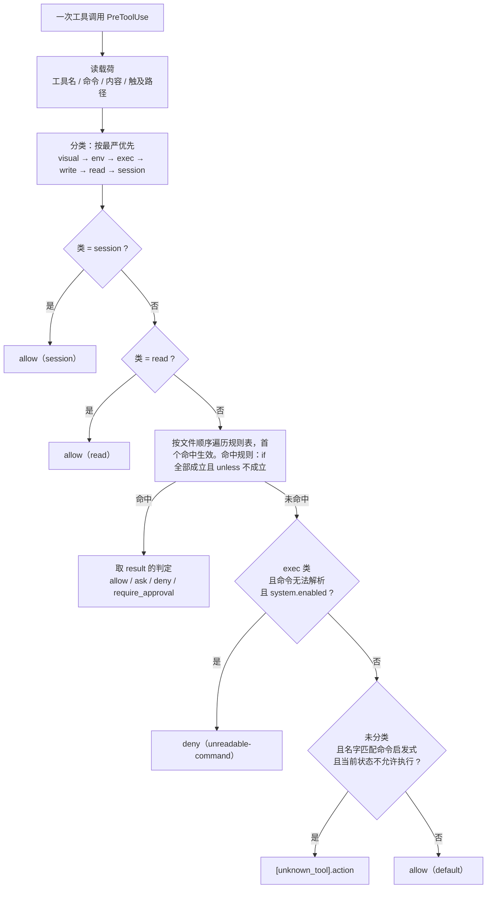

# OCF 策略配置指南

[English](POLICY-GUIDE.md) | 中文

---

## 1. 规则格式

一条规则就是 `policy.toml` 里的一段 `[[rule]]`

```toml
[[rule]]
id      = "no-prod-config"                    # 规则标签
enabled = "switch"                            # 启用控制
kind    = "hard"                              # hard：hook；soft：常驻引导词
result  = "deny"                              # 命中结果
message = "生产配置是人类的，改完交给他"        # 可读解释
unless  = { computed = "control_plane" }      # 绕过情景

[rule.if]
class        = "write"                        # 匹配的工具类
path_matches = '^config/prod/'                # 本条规则独有的条件：匹配的路径正则
```

### 字段

| 字段        | 必填 | 含义                                                                    |
| ----------- | ---- | ----------------------------------------------------------------------- |
| `id`        | 是   | 规则标识                                                                |
| `enabled`   | 否   | 三种写法见下                                                            |
| `kind`      | 否   | `hard`（默认）或 `soft`                                                 |
| `label`     | 否   | 仅软规则必须。在常驻契约与参考区里列示时用的短名字                      |
| `[rule.if]` | 是   | 触发规则表                                                              |
| `unless`    | 否   | 绕过情景。硬规则为条件表；软规则描述绕过场景                            |
| `result`    | 否   | 仅硬规则必须。触发时的行为`allow` / `ask` / `deny` / `require_approval` |
| `else`      | 否   | 仅软规则可选。关闭时的注入内容                                          |
| `message`   | 是   | hook回传或引导词注入给agent的信息                                       |

### `enabled` 可用值

| 写法       | 含义       |
| ---------- | ---------- |
| `true`     | 总是开启   |
| `false`    | 总是禁用   |
| `"switch"` | 跟随主开关 |

### 条件（`[rule.if]` 的键）

每个键是一个条件，值是它要比较的东西

| 条件                                 | 比较对象                                                                                     |
| ------------------------------------ | -------------------------------------------------------------------------------------------- |
| `class`                              | 触发工具分类：`visual` / `env` / `exec` / `write` / `read` / `session` / `unknown`，或 `any` |
| `state`                              | 触发状态：`ready` / `asking` / `planning` / `executing` / `reporting` / `blocked`            |
| `tool`                               | 编辑器报告的工具名                                                                           |
| `command_matches`                    | 命令串的正则                                                                                 |
| `command_length_over`                | 命令长度上限                                                                                 |
| `command_statements_over`            | 语句数上限                                                                                   |
| `command_repeats_at_least`           | 重复命令数量                                                                                 |
| `content_matches`                    | 即将写入的内容，外加原始工具输入                                                             |
| `environment_declared`               | 要求声明环境                                                                                 |
| `approval`                           | 要求批准状态                                                                                 |
| `computed`                           | 从命令算出来的标志，见下                                                                     |
| `fact` ＋ `is` / `is_not` / `is_set` | 人类或 hook 记下的事实；比较值 / 不等 / 非空                                                 |
| `write_target_unread`                | 这次调用会写，但写到哪里读不出来                                                             |
| `path_matches`                       | 路径正则匹配                                                                                 |
| `touches_protected`                  | 路径正则匹配保护文件清单                                                                     |

### 标志（`computed`）

| 标志              | 什么时候为真                                                                 |
| ----------------- | ---------------------------------------------------------------------------- |
| `control_plane`   | 每一条语句都按完整相对路径调用了入口脚本。读状态不算动手，所以不该被批准挡住 |
| `invokes_entry`   | 至少一条语句调用了入口脚本                                                   |
| `human_only_call` | 入口脚本后面跟的是**人类专属子命令**                                         |

### `result` 取值

| 取值               | 效果           |
| ------------------ | -------------- |
| `allow`            | 放行           |
| `ask`              | 询问           |
| `deny`             | 拒绝并说明原因 |
| `require_approval` | 拒绝并请求审查 |

---

## 2. 命中规则



---

## 3. 如何配置

| 目标动作           | 相关文件                    | 执行`reload`命令 | 重载窗口 |
| ------------------ | --------------------------- | ---------------- | -------- |
| 加／改一条门禁规则 | `policy.toml` 的 `[[rule]]` | √                | X        |
| 改一个阈值         | 改那条规则里对应的数字      | X                | X        |
| 让某个工具不再被拦 | 改`[tools]` 的对应列表      | X                | X        |
| 改一条软规则的措辞 | 改该规则的`message` 文字    | √                | X        |
| 停用一条规则       | 把它的`enabled` 改掉        | X                | X        |
| 调整整体严格程度   | 改`[system] enabled`        | X                | X        |
| 换挂钩事件         | 改`[hooks]` 各开关          | √                | √        |
| 加一条自检探针     | 改`[selftest.canary]`       | X                | X        |

> [!INFO]
> 改硬规则立即生效但文档不会同步。
> 使用reload来重载硬规则文档和软规则注入词
> 改 `[hooks]` 才需要重载窗口

### 配方一：加一条禁止规则

```toml
[[rule]]
id      = "no-prod-config"
enabled = "switch"
result  = "deny"
message = "生产配置是人类的，改完交给他"

[rule.if]
class        = "write"
path_matches = '^config/prod/'
```

要压过批准规则，就放在任何 `approval-required-*` **之前**

### 配方二：加一个工具

加进 `[tools]` 里对应的类即可

- 一个工具同时出现在两类里时，由**更严**的那类判（`visual` 最先）。
- 没登记的工具带命令就按命令类判；只带路径就匹配命令类名字启发式。
- 它的载荷字段如果不是默认的 `command` / `code`，就到 `[tools.field]` 里补一条字段路径。

### 配方三：改一个阈值

阈值是**写在使用它的那条规则里的数字**，位于该规则的[rule.if]。改完不需要 `reload`。

### 配方四：停用一条规则

把该规则 `enabled` 改成 `false`

### 配方五：加一条软规则

```toml
[[rule]]
id      = "my-discipline"
kind    = "soft"
label   = "短名字"
enabled = "switch"
message = """
开启时注入的那句话。"""
else    = """
关闭时注入的那句话。可省。"""

[rule.if]
occasion = "ask"
```

### 配方六：加一条自检探针

在 `[selftest.canary]` 里加一条。金丝雀必须**走真实 hook 入口**，否则它证明不了门禁还活着。整套至少要有**一条必须 deny、一条必须 allow**

## 4.关联文件与条目

- **字段与谓词词表**：`.github/ocf/policy.toml`
- **门禁、工具分类与规则清单**：`.github/work-control-flow.md`
- **每次提问注入的常驻引导词**：`.github/copilot-instructions.md`
- **结构断言清单**：`.github/ocf/tests/run.py`
- **项目总览与使用流程**：[`README.md`](README.md)
