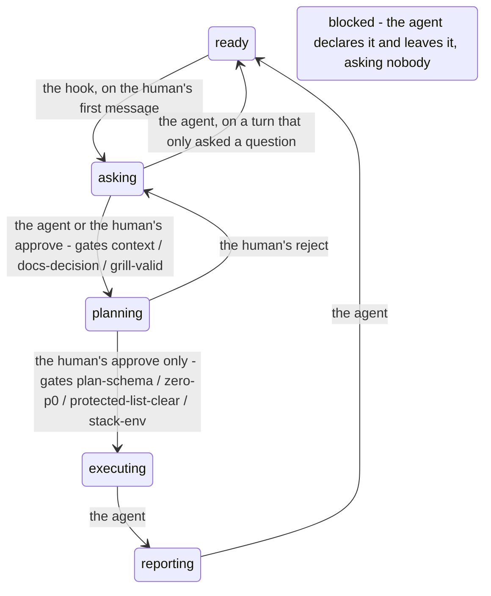

# Work Control Flow

English | [中文](README_CH.md)

---

## Project introduction

The goals of this project are,

1. as agent-assisted development increasingly becomes part of a computer-industry practitioner's work, to explore the human & agent collaboration workflow and the agent's **permission boundary**;
2. to provide a system. Through a whole built from well-designed prompts, a state machine and so on, it effectively raises the human-agent collaboration experience, distils the human collaboration steps that are necessary, balances working efficiency, quality and accuracy, and solves the problems that come from the agent and the human disagreeing: the agent overstepping, behaving unpredictably, answering badly.

The glossary is in the appendix.

### Have you hit these problems?

The most common accident with an AI agent is not that it cannot do the work, but that it does not understand plain speech (struck out) human intent — and that is not only about model quality.

- **No shared understanding**: starts before the requirement is clear, so what it delivers does not match what was expected, burning time and tokens
- **Out of bounds**: edits files, sets up environments, creates directories, runs commands silently or retries forever, causes unrecoverable damage after an error, overwrites comments and code the human wrote by hand
- **Poor answers**: full of syntax, logic, factual and comprehension errors; hallucination, not answering the question, repetition, meaninglessness, over-explaining (raising the cost of understanding, slowing the reader down) or too shallow (burning too many tokens)
- **Bad collaboration**: work with no order, no plan, no report; hard to hold a conversation with
- **Chain-of-thought pollution**: technical detail written into a user-facing UI, the model's reasoning, its mistakes and its trade-offs written into comments, poor writing in the deliverable

> Sometimes it is not the agent's fault: the human is too lazy, or does not know how, to write a good prompt
> and to state the working elements clearly.
> This system standardises and streamlines the human-agent workflow out of real project experience,
> placing demands and limits on both sides, to reach the best collaboration and a better deliverable.

### Advantages

| Feature                                                             | What it gives you                                                                                                                                                 |
| ------------------------------------------------------------------- | ----------------------------------------------------------------------------------------------------------------------------------------------------------------- |
| **A hard gate plus soft guidance**                                  | Hooks are designed to build the workflow and constrain the model's behaviour, and light guidance words focus the model's attention on what matters                |
| **A light core**                                                    | A single .py file at the core, standard library only, cross-platform                                                                                              |
| **Approval does not rest on understanding, and cannot be bypassed** | Only a human running the`approve` command in their own terminal can approve                                                                                       |
| **The protected list**                                              | A protected directory limits the model's access to files, and self-protects the system                                                                            |
| **A rules and configuration system**                                | 21 hard rules and 12 soft rules distilled from real project experience, managed conveniently as key-value toml, able to switch the whole system on or off at once |
| **The terminal stays in the human's hands**                         | It blocks execution before approval, long commands, multi-statement chains, silenced output, interactive blocking, repeated execution and consecutive failures    |
| **Auditable end to end**                                            | State transitions, authorizations and failures are all visible in`.orchestrator/journal.log`                                                                      |
| **Classic tests built in**                                          | Self-checks at deployment, at the start of a conversation and on every rule reload, so the system never fails silently                                            |
| **Easy to deploy, package and migrate**                             | Convenient to deploy; one command migrates the system and its state                                                                                               |

Other features are for you to find!

### The state flow

How the transitions work: which part of the system performs them, and when



When the agent believes, or the system in fact hits, a block, it moves from any state to `blocked`.

When the agent believes the block is resolved, it leaves.

You may change it to suit your needs. Note: a more complex state machine and more sub-agent identities may bring too much time and cost overhead, and a distracted model may make the result worse than the design expected.

### The pre-configured rules

| Rule                       | Kind | What it does                                                                                      | Default            |
| -------------------------- | ---- | ------------------------------------------------------------------------------------------------- | ------------------ |
| `plan-file-writable`       | hard | Allows each round's plan to be saved as a file                                                    | follows the switch |
| `failure-budget`           | hard | Blocks once consecutive failures reach the limit, and waits for the human                         | follows the switch |
| `visual-tool`              | hard | Disables vision tools                                                                             | follows the switch |
| `visual-command`           | hard | Disables vision commands                                                                          | follows the switch |
| `human-only-subcommand`    | hard | The agent may not run human commands for the human                                                | follows the switch |
| `advance-to-executing`     | hard | The agent may not enter the `executing` state                                                     | follows the switch |
| `self-authorization-write` | hard | The agent may not create a human-command script                                                   | follows the switch |
| `unread-write-target`      | hard | Disables modifying commands whose target path cannot be parsed (experimental)                     | follows the switch |
| `touches-protected`        | hard | No editing a file on the protected list (relies on target-path parsing)                           | follows the switch |
| `command-too-long`         | hard | No command over the character limit                                                               | follows the switch |
| `too-many-statements`      | hard | No command over the statement limit (experimental)                                                | follows the switch |
| `silenced-output`          | hard | No silenced terminal commands                                                                    | follows the switch |
| `interactive-command`      | hard | No interactive commands                                                                          | follows the switch |
| `test-authorization`       | hard | No unauthorized tests                                                                            | follows the switch |
| `undeclared-env-command`   | hard | No installing dependencies or probing the toolchain before the human declares the environment     | follows the switch |
| `destructive`              | hard | No destructive commands (experimental)                                                           | follows the switch |
| `undeclared-env-tool`      | hard | No installing packages / extensions / scaffolding before the environment is declared              | follows the switch |
| `approval-required-write`  | hard | Editing a file outside an acting state needs approval                                            | follows the switch |
| `approval-required-exec`   | hard | Running a command outside an acting state needs approval (exempt when only reading the control plane) | follows the switch |
| `approval-required-env`    | hard | Changing the environment outside an acting state needs approval                                  | follows the switch |
| `repeated-command`         | hard | Blocks when a repeated command passes the limit, and waits for the human                          | follows the switch |
| `intake-grilling`          | soft | One question per turn during intake, to sharpen the questioning                                  | follows the switch |
| `independent-audit`        | soft | Audits the plan independently until P0 reaches zero, then asks for the human's approval command    | follows the switch |
| `no-screenshots`           | soft | No vision tools (when switched off, name the vision practice instead)                            | follows the switch |
| `beginner-mode`            | soft | Explain every domain primitive and record it in the glossary; a vague request gets the three-part question | follows the switch |
| `human-only-commands`      | soft | The agent may not run human commands for the human                                                | follows the switch |
| `write-for-the-reader`     | soft | Guides the agent to leave blanks and tune the text in the artifact to its reader (experimental, depends on model quality) | follows the switch |
| `a-way-back`               | soft | Guides the agent to keep an archive or a rollback for medium and high risk                        | follows the switch |
| `plan-write-file`          | soft | Gives the plan as a file                                                                          | **off**            |
| `plan-template`            | soft | Writes the plan with the recommended template                                                     | **on**             |
| `report-template`          | soft | Writes the report with the recommended template                                                   | **on**             |
| `grill-with-docs`          | soft | Questions against `CONTEXT.md` and `docs/adr/`                                                    | follows the switch |
| `question-is-not-a-task`   | soft | When the human only asks a question, return to `ready` once it is answered                        | follows the switch |

### Composition

| Part                   | Where                             | What it does                                                                                                                                                                                                                                      |
| ---------------------- | --------------------------------- | ------------------------------------------------------------------------------------------------------------------------------------------------------------------------------------------------------------------------------------------------- |
| **State machine**      | `TRANSITIONS` in `ocf.py`         | `ready → asking → planning → executing → reporting → ready`, bypass: `blocked`                                                                                                                                                                    |
| **Command units**      | the command table in`ocf.py`      | The agent may use`status` / `set` / `gate` / `journal` / `fail` / `ok` / `advance` / `init` / `selftest` / `verify`; the human may use `approve` / `reject` / `protect` / `unprotect` / `reload` / `install` / `package`                          |
| **Persistence**        | `.orchestrator/`                  | `state` the machine state, `facts` the distilled working elements, `glossary.md` the terms, `journal.log` the audit, `exec.log` the command-repeat record, `prompt-log` the intake record, `plan.md` the plan as a file |
| **Configurable rules** | `.github/ocf/policy.toml`         | 21 hard rules + 12 soft rules                                                                                                                                                                                                                     |
| **VS Code hook**       | `.github/hooks/orchestrator.json` | Four events at`ocf.py hook`: SessionStart / UserPromptSubmit / PreToolUse / PostToolUse                                                                                                                                                           |

### Project structure

```text
.
├─ .github/                    the delivery unit: copy it into any repository root
│  ├─ ocf/                     the one implementation and the one configuration
│  │  ├─ ocf.py                state machine, gates, rule evaluator, hook entry
│  │  ├─ policy.toml           rules as data: 33 of them, first match wins
│  │  └─ tests/run.py          offline cases and structural checks (shipped)
│  ├─ hooks/orchestrator.json  the wiring for four events (written by reload)
│  ├─ agents/  prompts/        subagents and the human-facing skills
│  ├─ assets/                  the plan and report templates
│  ├─ protected.txt            the protected list
│  ├─ copilot-instructions.md  the standing contract (generated region + rule text)
│  └─ work-control-flow.md     the guide, with the reference region reload renders
├─ .orchestrator/              runtime state
│  ├─ state  facts             where the machine is, and the working elements
│  ├─ journal.log  exec.log    the audit, and the command-repeat record
│  └─ glossary.md  plan.md     the terms, and this round's plan
├─ release/
│  ├─ payload/                 the half that gets published
│  └─ build/                   build.ps1 / engine_checks.py / ocf-gate.iss
├─ dist/                       the artifacts: setup.exe and the staged tree
├─ README.md  README_CH.md
├─ POLICY-GUIDE.md  POLICY-GUIDE_CH.md
└─ VERSION
```

---

## Environment dependencies

| Item                 | Requirement                                                                                                            |
| -------------------- | ---------------------------------------------------------------------------------------------------------------------- |
| **Runtime**          | Python 3,`tomllib` or `tomli`, no build.                                                                               |
| **Host**             | VS Code GitHub Copilot Chat                                                                                            |
| **hooks**            | An organization policy may disable hooks                                                                               |
| **Interpreter name** | `python` on Windows, `python3` elsewhere                                                                               |
| **Window reload**    | `json` is not hot-reloaded, so the window must be reloaded; (optional) confirm with `Developer: Show Agent Debug Logs` |

---

## Installation and deployment

### Where the resources are

| Key                                 | Value                                                           |
| ----------------------------------- | --------------------------------------------------------------- |
| `.github/`                          | The delivery unit. Plain text; copy it into any repository root |
| `release/payload/`                  | The publishing half                                             |
| `release/build/`                    | The build and packaging half                                    |
| `dist/ocf-gate-<version>-setup.exe` | The distribution package                                        |
| `dist/ocf-gate-<version>/`          | The staged tree                                                 |

### One-click deployment

Double-click `dist/ocf-gate-<version>-setup.exe` and pick the **target repository** on the first page

### Manual deployment

```text
# 1) Copy .github/ into the target repository root
# 2) Initialise the runtime
python  .github\ocf\ocf.py init      # Windows
python3 .github/ocf/ocf.py init      # other platforms
# 3) Register the paths this repository must protect
python .github\ocf\ocf.py protect "src/**"
# 4) Self-check
python .github\ocf\ocf.py selftest
# 5) Generate the configuration into the artifacts
python .github\ocf\ocf.py reload
# 6) Reload the VS Code window so the hooks take effect
```

Out of the box the master switch `system.enabled` in `policy.toml` is `false`; after deploying, set it to `true` first, then run `reload`.

### Confirm the deployment

```text
python .github\ocf\ocf.py verify      # deployment usability check
python .github\ocf\ocf.py selftest    # gate status check
```

---

## Getting started

Just tell the agent your task.

The human-facing skills this system provides: `/work-intake`, `/work-plan`, `/bug-route`.

### Session start

- **User**: 🦜 says something witty 🦜
- **System**:
  - the `SessionStart` hook fires: the self-check runs, and its findings are classified as environment / policy / system / ok and injected;
  - the `UserPromptSubmit` hook fires: `ready` to `asking`, recording `first_prompt` and the transition
- **Model**: reads the self-check findings, reads what the human said.

### Intake

- **User**: answer the consensus gaps from the model's reply - goal, tools, references, deliverables, code style, plus the docs decision and the consensus. The recommended three-part structure is shown in the `argument-hint` of `.github/agents/orchestrator.agent.md`: Goal / Requirements / Deliverables
- **System**:
  - every time the human replies: `grill_rounds` +1
  - write `prompt-log`
  - when the model asks for a state transition: verify that `context`, `docs-decision`, `grill-valid` and the rest are complete, and record the transition
  - on the transition 'asking' to 'planning', clear the intake record and counters
- **Model**:
  - asks the human and fills the working elements into `facts`;
  - when it believes the questions are done: asks the system for the state transition `advance planning`

### Plan

- **User**:
  - review the plan
  - (optional) explicitly ask for a plan file
- **System**: checks that the plan elements `plan-schema`, `zero-p0`, `protected-list-clear`, `stack-env` are complete. The plan is given in the conversation by default
- **Model**:
  - writes the plan according to the template
  - has a subagent audit it independently
  - repeats the above until the P0 count reaches zero
  - delivers the action report and the risk design report
  - asks the human to approve

### Execution

- **User**:
  - run `python ocf approve "<a reason of at least 8 characters>"` in the terminal, then wake the model
  - (optional) explicitly ask for tests, a build, visual verification or a file report
- **System**:
  - allows the agent to make command-class tool calls (undeclared tools fall back to heuristic matching)
  - checks whether the commands the agent runs are repeated, silent, or need no waiting
- **Model**:
  - carries out the plan
  - when it has to deviate from the plan: `advance blocked` and re-plan.
  - writes the report according to the template

---

## Experimental

**Reader judgement test**

Before switching `write-for-the-reader` on, you can first test the model's ability.

50 model use-case scenarios are prepared.
The model tells each artifact's target audience (the reader) by `write-for-the-reader`.

**HOW TO**

1. Run `python release\build\reader_eval.py` and take the questions;
2. Send the questions to **the model you want to measure**, and save its answers as JSON in the format the script gives;
3. Run `python release\build\reader_eval.py --answers <file_name>.json` for the accuracy and every MISS.

---

## Future plans

In order...

| Item                                      | Notes                                                                                          |
| ----------------------------------------- | ---------------------------------------------------------------------------------------------- |
| **Tests**                                 | Close the coverage gaps for the hard rules; quantify the soft rules, or mark them unmeasurable |
| **New and improved features** (long term) | Keep distilling rules and gates from the suggestions collected                                 |
| **Adapt to the DeepSeek harness**         | Stop the gate depending on VS Code's hook events                                               |
| **Adapt to Codex**                        | As above                                                                                       |
| **Publish as a VS Code extension**        | —                                                                                              |

---

## Appendix

### Release

Produce every artifact:

```text
.\release\build\build.ps1
```

**Checks first, then packages**: the case table and structural checks in the delivery set, and the engine self-check.

### Updating

**Run the new exe, and pick the same repository**

Before installing, the payload is checked against the release's hash manifest; if you have done your own development, save your work first.
`policy.toml`, `protected.txt`, `.orchestrator/` and the `facts` keys migrate as they are; where they differ, the new version is written beside them as a `.dist` of the same name for you to compare.

### Uninstalling

Deleting `.github/hooks/` and `.orchestrator/` stops all enforcement.

### Daily operations and checks

Key

| Command                              | What it does                                                                                                        |
| ------------------------------------ | ------------------------------------------------------------------------------------------------------------------- |
| `python .github\ocf\ocf.py reload`   | Rebuilds the standing guidance, the vocabulary region of`policy.toml`, and the reference region of the system guide |
| `python .github\ocf\ocf.py selftest` | Checks the environment, the policy, the hooks and the gate status                                                   |
| `python .github\ocf\tests\run.py`    | The offline cases and structural checks in the delivery set                                                         |

Others

| Command                                | What it answers                                            |
| -------------------------------------- | ---------------------------------------------------------- |
| `python .github\ocf\ocf.py status`     | State machine state, facts, configuration elements         |
| `python .github\ocf\ocf.py journal 20` | The audit: state transitions, authorizations, failures     |
| `python .github\ocf\ocf.py gate`       | Runs the gates: whether a transition is possible right now |
| `python .github\ocf\ocf.py verify`     | Deployment usability check                                 |

> [!WARNING]
> After editing `.github/ocf/`, set the entries you want to enable in the configuration to true first, then run `reload`.

### Modifying

| What to change            | How                                                                                                                                                                                        | Window reload? |
| ------------------------- | ------------------------------------------------------------------------------------------------------------------------------------------------------------------------------------------ | -------------- |
| **Gate rules**            | Edit`[[rule]]` in `policy.toml`. Rules are data, first match wins, exemptions first and catch-alls last                                                                                    | no             |
| **Thresholds**            | Edit the number inside the rule                                                                                                                                                            | no             |
| **Soft rules**            | Edit the text of the`kind = "soft"` rule, then `reload`; that paragraph of the standing guidance changes with it                                                                           | no             |
| **Tool classes**          | Edit the lists under`[tools]` and the field paths under `[tools.field]`. Adding a tool **needs no code change**                                                                            | no             |
| **Turning something off** | Edit the`[hooks]` master switch or an event switch, then `reload`                                                                                                                          | **yes**        |
| **The gate switch**       | Edit`[system] enabled`. Only `true` / `false` are accepted; anything else is applied as `true` (strictest) and reported                                                                    | no             |
| **Self-check canaries**   | Edit`[selftest.canary]`. A canary must go through the real hook entry point, or it cannot prove the gate is alive                                                                          | no             |
| **The state machine**     | Edit`TRANSITIONS` in `ocf.py`, and keep `STATES` consistent with it                                                                                                                        | no             |
| **Hook events**           | Edit`[hooks]` in `policy.toml`, then `reload`. **Do not hand-edit** `.github/hooks/orchestrator.json` - it is generated by `reload`, and a hand edit fails an assertion and is overwritten | **yes**        |
| **Generated prose**       | The standing guidance, the configuration's vocabulary region and the guide's reference region are all generated by`reload`; run it after a configuration change                            | no             |
| **Hand-written prose**    | The prose part of the system guide, this README and its Chinese version, the prompt and agent definitions                                                                                  | no             |

### Common problems and suggestions

| Symptom                                                                       | What to do / Notes                                                                                                                                                   |
| ----------------------------------------------------------------------------- | --------------------------------------------------------------------------------------------------------------------------------------------------------------------- |
| The agent can do nothing / I broke the whole system                           | Rename `.github/hooks/orchestrator.json` to `.json.off` and reload the window, then let the agent handle it or reinstall                                              |
| The hook does not react at all                                                | The configuration was not hot-reloaded. Reload the window; check `Developer: Show Agent Debug Logs`                                                                   |
| Self-check reports an environment finding: the hooks do not point at `ocf.py` | The agent did not pick Work Orchestrator, the hook is broken. Pick that agent, or fix `orchestrator.json` and reload                                                  |
| Self-check reports a policy finding                                           | **The gate refuses only "changes"; reading and thinking tools still pass**, so the agent can help you locate it. Look at the `policy.toml` diff and restore the last working version; or `selftest` prints the parse failure reason |
| Self-check reports a system finding                                           | A canary failed = the gate no longer enforces the policy. Fix the policy as directed; do not route around it                                                          |
| The hook errors saying `$f` became empty in a command                         | The hooks command string was interpolated by the outer shell. Remove every `$` from that string                                                                       |
| The generated-region assertion always misfires                                | An editor or formatter reformatted after reload. Run reload once, or ignore it                                                                                        |
| Approval is decided at the text layer, not by process identity                | The design does not consider deliberate bypass                                                                                                                        |
| "What counts as a substantive answer" has no code test                        | Related to model quality; the cost of adding guidance words outweighs the effect                                                                                      |
| The gate's strength ceiling is set by the model                               | Related to model quality                                                                                                                                              |
| My agent still seems hopelessly stupid                                        | Confirm `Work Orchestrator` is selected both at the start of the conversation and now                                                                                 |

The remaining limitations are in the "Known limitations" section of `.github/work-control-flow.md`.

### Contact

- If you have opinions and questions, or feedback on the experience or a bug, please write to **liwenhu2y@outlook.com**.
- Or open an issue or a discussion at [GitHub]().

### Glossary

| Term                   | Chinese       | Meaning                                                                                                                                           |
| ---------------------- | ------------- | ------------------------------------------------------------------------------------------------------------------------------------------------- |
| **State machine**      | 状态机        | `ready / asking / planning / executing / reporting / blocked` six states, plus the transitions between them |
| **Gate**               | 门禁          | **A precondition of a state transition**                                                                   |
| **Rule**               | 规则          | The verdict for **one tool call**: `allow` / `ask` / `deny` / `require_approval`. First match wins          |
| **Hard rule**          | 硬规则        | A rule the hook reads and answers with outside the conversation                                            |
| **Soft rule**          | 软规则        | Natural-language semantics cannot be checked by code, so the model applies it from the standing guidance   |
| **Configuration**      | 配置          | The configuration file `.github/ocf/policy.toml`                                                           |
| **Authorization**      | 授权          | The human runs `python ocf.py approve`                                                                     |
| **Protected list**     | 受保护清单    | `.github/protected.txt`                                                                                    |
| **Maintenance window** | 维护窗口      | The `system.enabled` item in the configuration                                                             |
| **Canary**             | 金丝雀        | A hook probe case; at least one deny and one allow                                                         |
| **Facts**              | 事实          | The working elements the human supplies (goal, deliverables, environment declaration, audit result), in `.orchestrator/facts` |
| **Intake**             | 受理          | The process of drawing the background out while in `asking`                                                |
| **Payload**            | 载荷 / 中间树 | The `release/payload/` used for publishing                                                                 |
