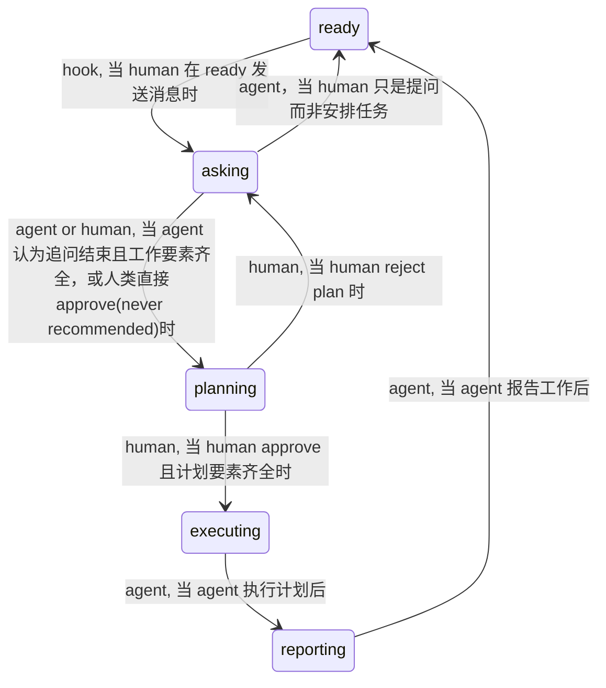

# Work Control Flow

[English](README.md) | 中文

---

## 项目介绍

本项目的目标是，

1. 在 agent 辅助开发日益成为计算机行业从业者工作一部分的趋势下，探索 human & agent 的协作工作流以及 agent 的**权限边界**。
2. 提供一套系统。通过良好设计的提示词和状态机等构成的整体，有效提升人机协作体验，提炼必要的人类协作环节，平衡工作效率、质量和准确性，解决agent与人类共识不统一造成的agent操作越界、行为不可预测、回答质量低等问题。

术语表见附录节

### 你是否遇到过以下问题？

AI agent 最常见的事故不是不会干，而是听不懂人话（划掉）不理解人类意图——这不止与模型质量有关

- 共识未统一：没问清需求就开工，交付物与预期不相符，浪费大把时间和token把人类气到红温
- 工作越界：没等批准就改文件、建环境、建目录、静默或无限重试命令、造成巨大破坏缺不可恢复、改掉人类手搓的注释和代码，
- 回答质量低：充斥着语法、逻辑、事实、理解错误；模型幻觉、答非所问、回答重复、无意义、过度专业（增加理解门槛，降低阅读速度）或浅显（token花费太大）
- 协作体验差：工作没条理，没计划，不报告，交流困难
- 思维链污染：把技术细节写进面向用户的UI，把模型思考、犯错和权衡写进注释，交付物中文字质量低

> 其实有时候并不止是agent的锅，而是人类懒于或不会设计良好的提示词，把工作要素交代清楚。
> 这套系统根据大量实际项目经验，将人类与agent的工作流标准化，流程化，对人类和agent均进行一定程度上的要求和限制以达到最佳协作效果，进而优化交付物质量

### 优势

| 特性                       | 说明                                                                                       |
| -------------------------- | ------------------------------------------------------------------------------------------ |
| **硬门禁+软引导词**        | 精心设计 hook 搭建工作流并限制模型行为,用轻量引导词集中模型对开发重点的注意力              |
| **轻量核心**               | 单py文件核心，依赖标准库，跨平台                                                           |
| **批准不靠理解，不可规避** | 批准只能由人类在自己终端 执行`approve`命令                                                 |
| **受保护清单**             | 用保护目录限制模型对文件的访问并进行系统自保护                                             |
| **规则和配置系统**         | 从实际项目经验中提炼出 21 条硬规则与 12 条软规则，通过键值toml便捷管理，急速启禁用整个系统 |
| **保证终端掌握在人类手中** | 拦截未批准前的执行、长命令、多语句串联、静默输出、交互阻塞、反复执行、连续失败             |
| **全程可审计**             | 状态流转、授权、失败都在`.orchestrator/journal.log` 可见                                   |
| **预制经典测试**           | 部署时、对话开始时、重载规则时自检，保证系统永不静默失效                                   |
| **轻松部署、打包和迁移**   | 部署方便，一行命令迁移系统及其状态                                                         |

其他特性等你发现！

### 状态流

状态转移说明：由系统中哪一部分执行，执行时机



当 agent 认为或系统事实上发生阻塞时，将从任意状态转移至blocked

当 agent 认为阻塞解决时，将离开。

您可以根据自己的需要进行修改。注意：更复杂的状态机以及更多的子agent身份可能带来过大的时间和成本开销，且模型注意力分散可能使得效果不如设计预期

### 预配置规则

| 名称                       | 种类 | 内容                                                                | 默认     |
| -------------------------- | ---- | ------------------------------------------------------------------- | -------- |
| `plan-file-writable`       | 硬   | 允许将每轮计划保存为文件                                            | 跟随开关 |
| `failure-budget`           | 硬   | 连续失败到上限就阻塞，等人类指令                                    | 跟随开关 |
| `visual-tool`              | 硬   | 禁用视觉工具                                                        | 跟随开关 |
| `visual-command`           | 硬   | 禁用视觉命令                                                        | 跟随开关 |
| `human-only-subcommand`    | 硬   | 不允许agent代行人类命令                                             | 跟随开关 |
| `advance-to-executing`     | 硬   | 不允许agent进入`executing`状态                                      | 跟随开关 |
| `self-authorization-write` | 硬   | 不允许agent创建人类命令脚本                                         | 跟随开关 |
| `unread-write-target`      | 硬   | 禁用无法解析目标路径的修改型命令(实验性)                            | 跟随开关 |
| `touches-protected`        | 硬   | 不允许修改保护清单中的文件(依赖目标路径解析)                        | 跟随开关 |
| `command-too-long`         | 硬   | 不允许命令字符量超限                                                | 跟随开关 |
| `too-many-statements`      | 硬   | 不允许命令语句量超限(实验性)                                        | 跟随开关 |
| `silenced-output`          | 硬   | 不允许终端静默命令                                                  | 跟随开关 |
| `interactive-command`      | 硬   | 不允许交互式命令                                                    | 跟随开关 |
| `test-authorization`       | 硬   | 不允许未授权测试                                                    | 跟随开关 |
| `undeclared-env-command`   | 硬   | 不允许人类未声明环境时装依赖或探测工具链                            | 跟随开关 |
| `destructive`              | 硬   | 不允许破坏性命令(实验性)                                            | 跟随开关 |
| `undeclared-env-tool`      | 硬   | 不允许环境未声明时装包 / 装扩展 / 脚手架                            | 跟随开关 |
| `approval-required-write`  | 硬   | 非执行状态下修改文件要求批准                                        | 跟随开关 |
| `approval-required-exec`   | 硬   | 非执行状态下执行命令要求批准（只看控制面时豁免）                    | 跟随开关 |
| `approval-required-env`    | 硬   | 非执行状态下变更环境要求批准                                        | 跟随开关 |
| `repeated-command`         | 硬   | 重复命令超限时阻塞，等待人类指令                                    | 跟随开关 |
| `intake-grilling`          | 软   | 受理环节一次一问，优化追问                                          | 跟随开关 |
| `independent-audit`        | 软   | 计划独立审计至P0归零并请求人类命令批准                              | 跟随开关 |
| `no-screenshots`           | 软   | 不允许视觉工具(关闭时推荐指定视觉实践形式)                          | 跟随开关 |
| `beginner-mode`            | 软   | 讲清每个领域原语并落到术语表；请求含糊时用三段式反问                | 跟随开关 |
| `human-only-commands`      | 软   | 不允许agent代行人类命令                                             | 跟随开关 |
| `write-for-the-reader`     | 软   | 引导agent留白并根据目标群体优化交付物中的文本(实验性，依赖模型质量) | 跟随开关 |
| `a-way-back`               | 软   | 引导agent在中高风险时保留存档或回档方式                             | 跟随开关 |
| `plan-write-file`          | 软   | 将计划作为文件提供                                                  | 关       |
| `plan-template`            | 软   | 使用推荐模板撰写计划                                                | 开       |
| `report-template`          | 软   | 使用推荐模板撰写报告                                                | 开       |
| `grill-with-docs`          | 软   | 根据`CONTEXT.md` 与 `docs/adr/`追问                                 | 跟随开关 |
| `question-is-not-a-task`   | 软   | 当人类仅提问时，问题解决后返回ready                                 | 跟随开关 |

### 项目组成

| 组成             | 位置                              | 说明                                                                                                                                                                                                     |
| ---------------- | --------------------------------- | -------------------------------------------------------------------------------------------------------------------------------------------------------------------------------------------------------- |
| **状态机**       | `ocf.py` 的 `TRANSITIONS`         | `ready → asking → planning → executing → reporting → ready`，旁路： `blocked`                                                                                                                            |
| **命令单元**     | `ocf.py` 的命令表                 | agent 可用`status` / `set` / `gate` / `journal` / `fail` / `ok` / `advance` / `init` / `selftest` / `verify`；人类可用 `approve` / `reject` / `protect` / `unprotect` / `reload` / `install` / `package` |
| **持久化**       | `.orchestrator/`                  | `state` 状态机状态、`facts` 提炼的工作要素、`glossary.md` 术语、`journal.log` 审计、`exec.log` 命令重复记录、`prompt-log` 受理期记录、`plan.md` 文件形式计划                                             |
| **可配置规则**   | `.github/ocf/policy.toml`         | 21 条硬规则 + 12 条软规则                                                                                                                                                                                |
| **VS Code hook** | `.github/hooks/orchestrator.json` | 四个事件位于`ocf.py hook`：SessionStart / UserPromptSubmit / PreToolUse / PostToolUse                                                                                                                    |

### 项目结构

```text
.
├─ .github/                    交付单元
│  ├─ ocf/
│  │  ├─ ocf.py                状态机、门禁、规则求值、hook 入口
│  │  ├─ policy.toml           规则
│  │  └─ tests/run.py          离线用例 + 结构断言
│  ├─ hooks/orchestrator.json  四个事件的接线
│  ├─ agents/  prompts/        子 agent 与可用 skill
│  ├─ assets/                  计划与报告模板
│  ├─ protected.txt            保护清单
│  ├─ copilot-instructions.md  常驻引导词
│  └─ work-control-flow.md     说明书(for agent)
├─ .orchestrator/              运行时
│  ├─ state  facts             状态机状态 与 工作要素
│  ├─ journal.log  exec.log    审计 与 命令重复记录
│  └─ glossary.md  plan.md     术语 与 本轮计划
├─ release/
│  ├─ payload/                 发布载荷
│  └─ build/                   打包、构建和测试套件
├─ dist/                       产物与中间树
├─ README.md  README_CH.md
├─ POLICY-GUIDE.md  POLICY-GUIDE_CH.md
└─ VERSION
```

---

## 环境依赖

| 项           | 要求                                                                         |
| ------------ | ---------------------------------------------------------------------------- |
| **运行时**   | Python 3,`tomllib` or `tomli`, no build.                                     |
| **宿主**     | VS Code GitHub Copilot Chat                                                  |
| **hooks**    | 组织策略可能禁用 hooks                                                       |
| **解释器名** | Windows 作`python`，其它平台作 `python3`                                     |
| **重载窗口** | `json` 不会热加载，须重载窗口，(可选) `Developer: Show Agent Debug Logs`确认 |

---

## 安装和部署

### 资源源位置

| 键                               | 值                                     |
| -------------------------------- | -------------------------------------- |
| `.github/`                       | 交付单元。纯文本，复制进任意仓库根即可 |
| `release/payload/`               | 发布部分                               |
| `release/build/`                 | 构建和打包部分                         |
| `dist/ocf-gate-<版本>-setup.exe` | 分发包                                 |
| `dist/ocf-gate-<版本>/`          | 中间树                                 |

### 一键部署

双击 `dist/ocf-gate-<版本>-setup.exe`，在向导第一页选**目标仓库**

### 手动部署

```text
# 1) 把 .github/ 复制进目标仓库根
# 2) 初始化运行时
python  .github\ocf\ocf.py init      # Windows
python3 .github/ocf/ocf.py init      # 其他平台
# 3) 登记本仓库要保护的路径
python .github\ocf\ocf.py protect "src/**"
# 4) 自检
python .github\ocf\ocf.py selftest
# 5) 把配置生成到产物里
python .github\ocf\ocf.py reload
# 6) 重载 VS Code 窗口，让 hooks 生效
```

出厂时 `policy.toml` 的总开关 `system.enabled` 默认 `false`，部署后请先改成 `true`，再跑 `reload`。

### 部署后确认

```text
python .github\ocf\ocf.py verify      # 部署可用性验证
python .github\ocf\ocf.py selftest    # 门禁状态验证
```

---

## 开始使用

直接对 agent 说你的任务即可。

本系统预置的人类可用skill：`/work-intake`、`/work-plan`、`/bug-route`。

### 会话开始

- **用户**：🦜 说了一些俏皮话 🦜
- **系统**：
  - `SessionStart`hook 触发： 自检，把结论按 environment / policy / system / ok 分类后注入；
  - `UserPromptSubmit` hook 触发： `ready` to `asking`，记下 `first_prompt`和状态转移
- **模型**：读自检结论，读人类信息。

### 受理

- **用户**：根据模型回复回答共识缺口——目标、工具、参考、交付物、代码风格，以及文档决定与共识。推荐使用的三段式结构见 `.github/agents/orchestrator.agent.md` 的 `argument-hint`：Goal / Requirements / Deliverables
- **系统**：
  - 人类每次回话： `grill_rounds` +1
  - 写 `prompt-log`
  - 模型请求状态转移时: 验证 `context`、`docs-decision`、`grill-valid`等要素完整性，记录状态转移
  - 进行状态转移 'asking' to 'planning', 清空受理期记录与计数
- **模型**：
  - 追问人类，补充工作要素到 `facts`；
  - 模型认为追问结束时：向系统发起状态转移请求 `advance planning`

### 计划

- **用户**：
  - 审阅计划
  - (可选)明确要求计划文件
- **系统**：检验计划要素`plan-schema`、`zero-p0`、`protected-list-clear`、`stack-env`完整性。默认在对话中提供计划
- **模型**：
  - 根据 模板 撰写计划
  - 子agent独立审查
  - 重复以上步骤直至 P0 问题计数归零
  - 交付行动与风险设计报告
  - 请求人类批准

### 执行

- **用户**：
  - 终端 `python ocf approve "<8字符以上理由>"`后主动会话起模型
  - (可选)明确指定测试，构建，视觉验证和文件报告
- **系统**：
  - 允许agent执行命令类工具调用（未声明的工具采用启发式匹配）
  - 检验agent执行的命令是否重复，静默，无需等待
- **模型**：
  - 执行计划内容
  - 执行时不得不偏离计划内容时： `advance blocked` 并重新规划。
  - 根据 模板 撰写报告

---

## 实验性内容

**读者判断测试**

在开启`write-for-the-reader`前，您可以先对模型能力进行测试

我们预设了50条模型使用场景
模型将按 `write-for-the-reader` 分辨每件交付物的目标群体(读者)。

**HOW TO**

1. 执行 `python release\build\reader_eval.py`，拿到题面；
2. 把题面发给**你要测的那个模型**，按脚本给出的格式把它的回答存成 JSON；
3. 执行 `python release\build\reader_eval.py --answers <file_name>.json`，得到准确率与逐条 MISS。

---

## 未来计划

按顺序...

| 事项                       | 说明                                                       |
| -------------------------- | ---------------------------------------------------------- |
| **测试**                   | 补齐硬规则用例覆盖缺口；实现软规则效果量化或正式标为不可测 |
| **添加和优化功能**（长期） | 持续从收集到的建议提炼规则与门禁                           |
| **适配 DeepSeek harness**  | 让门禁不再依赖 VS Code 的 hook 事件                        |
| **适配 Codex**             | 同上                                                       |
| **作为 VS Code 插件发布**  | —                                                          |

---

## 附录

### 发布

产出全部产物：

```text
.\release\build\build.ps1
```

**先检查，再打包**：交付套件里的用例表与结构断言，以及引擎自检

### 更新

**跑新版 exe，选同一个仓库**

安装前将检查发布物哈希清单核对载荷，如果你进行了二次开发，请注意先保存你的工作
`policy.toml`、`protected.txt`、`.orchestrator/` 与各 `facts` 键原样迁移，不一致时新版写成同名 `.dist` 供比对

### 卸载

删掉 `.github/hooks/` 与 `.orchestrator/` 即停止强制

### 日常操作与检验

重点

| 命令                                 | 目标                                                     |
| ------------------------------------ | -------------------------------------------------------- |
| `python .github\ocf\ocf.py reload`   | 重建常驻引导词、`policy.toml` 的词表区、说明文档的参考区 |
| `python .github\ocf\ocf.py selftest` | 检验环境、策略、挂钩、门径状态                           |
| `python .github\ocf\tests\run.py`    | 交付套件里的离线用例与结构断言                           |

其他

| 命令                                   | 目标                           |
| -------------------------------------- | ------------------------------ |
| `python .github\ocf\ocf.py status`     | 状态机状态、事实、配置要素     |
| `python .github\ocf\ocf.py journal 20` | 审计：状态流转、授权、失败     |
| `python .github\ocf\ocf.py gate`       | 运行门禁：当前能否进行状态转移 |
| `python .github\ocf\ocf.py verify`     | 部署可用性验证                 |

> [!WARNING]
> 改完 `.github/ocf/**`先将配置中想要开启的条目设为true，再跑`reload`。

### 修改

| 修改内容       | 修改方式                                                                                                                                    | 重载窗口 |
| -------------- | ------------------------------------------------------------------------------------------------------------------------------------------- | -------- |
| **门禁规则**   | 改`policy.toml` 的 `[[rule]]`。规则是数据，首个命中即生效，豁免放最前、兜底放最后                                                           | 不用     |
| **阈值**       | 直接改规则里那个数字                                                                                                                        | 不用     |
| **软规则**     | 改`kind = "soft"` 的规则文字，然后 `reload`，常驻引导词里那段话会跟着变                                                                     | 不用     |
| **工具分类**   | 改`[tools]` 各列表与 `[tools.field]` 的字段路径。新增工具**不必改代码**                                                                     | 不用     |
| **停用某项**   | 改`[hooks]` 的总开关或事件开关，然后 `reload`                                                                                               | y'ao     |
| **门禁开关**   | 改`[system] enabled`。只认 `true` / `false`，其它值按 `true`（最严）应用并报错                                                              | 不用     |
| **自检金丝雀** | 改`[selftest.canary]`。金丝雀必须走真实 hook 入口，否则证明不了门禁还活着                                                                   | 不用     |
| **状态机**     | 改`ocf.py` 的 `TRANSITIONS`，并让 `STATES` 与它一致                                                                                         | 不用     |
| **挂钩事件**   | 改`policy.toml` 的 `[hooks]`，然后 `reload`。**不要手改** `.github/hooks/orchestrator.json`——它由 `reload` 生成，手改会被断言判失败并被覆盖 | **要**   |
| **生成的文案** | 常驻引导词、配置的词表区、说明文档的参考区都由`reload` 生成，改配置后跑 `reload`                                                            | 不用     |
| **手写文案**   | 说明文档的散文部分、本 README 与它的中文版、各 prompt / agent 定义                                                                          | 不用     |

### 故障、自救与取舍

| 症状                 | 处理                                                                                                                                                    |
| -------------------- | ------------------------------------------------------------------------------------------------------------------------------------------------------- |
| 策略文件解析失败     | **门禁只拒绝「变更」，读与思考类工具仍放行**，所以让 agent 能帮你定位。先看 `policy.toml` 的改动，再恢复到最后可用版本；或 `selftest`打印解析失败的原因 |
| agent 什么都干不了   | 把`.github/hooks/orchestrator.json` 改名为 `.json.off` 并重载窗口，然后让agent修理                                                                      |
| 想放行机器改门禁代码 | 把`policy.toml` 的 `system.enabled` 设为 `false`。⚠️ **前提是文件本身可解析**，文件坏了就必须先用上面两条                                               |
| 彻底停用             | 见「卸载」                                                                                                                                              |

| 症状                                    | 根因                                  | 处理                                           |
| --------------------------------------- | ------------------------------------- | ---------------------------------------------- |
| hook 完全没反应                         | 配置未热加载                          | 重载窗口；查`Developer: Show Agent Debug Logs` |
| 自检报环境类问题： hooks 未指向`ocf.py` | agent没选Work Orchestrator、hook失效  | 选对应agent或改`orchestrator.json` 后重载      |
| 自检报策略类问题                        | 策略缺失或解析失败                    | 见「故障自救」                                 |
| 自检报系统类问题                        | 金丝雀未通过 = 门禁不再执行策略       | **最严重**。按提示修策略，不要绕过             |
| hook 报错说命令里`$f` 变空              | hooks 命令串被外层 shell 插值         | 命令串里去掉所有 $                             |
| 生成区断言误报                          | 编辑器/格式化器在reload后进行了格式化 | 运行一次reload或不用管                         |

| 项                           | 说明                                                     |
| ---------------------------- | -------------------------------------------------------- |
| `facts` 是纯文本             | 设计不考虑有目的地绕过                                   |
| 批准在文本层判定，非进程身份 | 设计不考虑有目的地绕过                                   |
| 「什么算具体答复」无代码判定 | 与模型质量相关，加入引导词带来的成本开销大于起到的效果   |
| 门禁强度上限由模型决定       | 与模型质量相关                                           |
| 怎的我的agent还是蠢笨如猪    | 请确认对话开始时和当前的agent都选择了`Work Orchestrator` |

其余限制见 `.github/work-control-flow.md` 的 Known limitations 一节。

> [!INFO] Info
> 以及...
> 一定一定要对 agent 有耐心，不要因为agent的“愚蠢”就发火而降低了自己的prompt质量。
> 当您的 agent 正在工作时，请时刻关注其工作内容和进展——以便及时刹车或纠正
> 毕竟AI agent只是一个工具 Orz

### 联系方式

- 如果您有意见和问题、使用体验和bug反馈，欢迎发送至 **liwenhu2y@outlook.com** ;)
- 或提交issue/discussion到 [GitHub]()

### 术语表

| 术语           | 英文                  | 含义                                                                                       |
| -------------- | --------------------- | ------------------------------------------------------------------------------------------ |
| **状态机**     | state machine         | `ready / asking / planning / executing / reporting / blocked` 六个状态，加上它们之间的迁移 |
| **门禁**       | gate                  | **状态迁移的前置条件**                                                                     |
| **规则**       | rule                  | 对**一次工具调用**的判定：`allow` / `ask` / `deny` / `require_approval`。首个命中即生效    |
| **硬规则**     | hard rule             | 由 hook 在会话外执行、给出判定的规则                                                       |
| **软规则**     | soft rule             | 自然语言语义无法被代码检查，用常驻引导词让由模型自觉执行                                   |
| **配置**       | policy / config       | 配置文件`.github/ocf/policy.toml`                                                          |
| **授权**       | authorization         | 人类执行`python ocf.py approve`                                                            |
| **受保护清单** | protected list        | `.github/protected.txt`                                                                    |
| **维护窗口**   | maintenance window    | 配置中`system.enabled` 项                                                                  |
| **金丝雀**     | canary                | hook 探针用例，至少一条 deny、一条 allow                                                   |
| **事实**       | facts                 | 人类提供的工作要素（目标、交付物、环境声明、审查结论等），`.orchestrator/facts`            |
| **受理**       | intake                | `asking` 状态下把背景问清楚的过程                                                          |
| **载荷**       | payload / staged tree | 发布用的`release/payload/`                                                                 |
